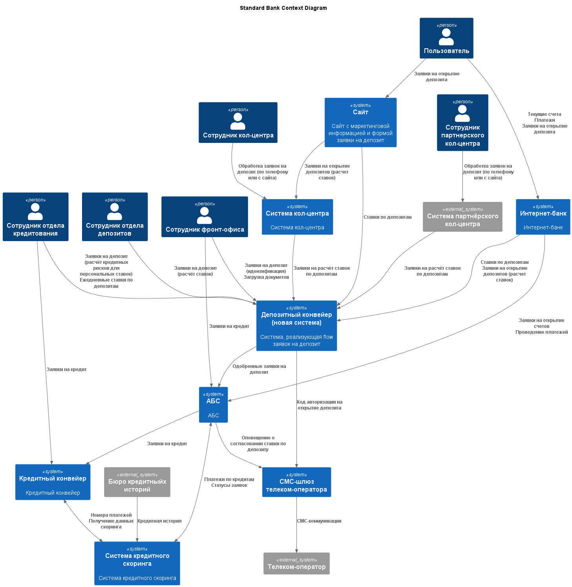
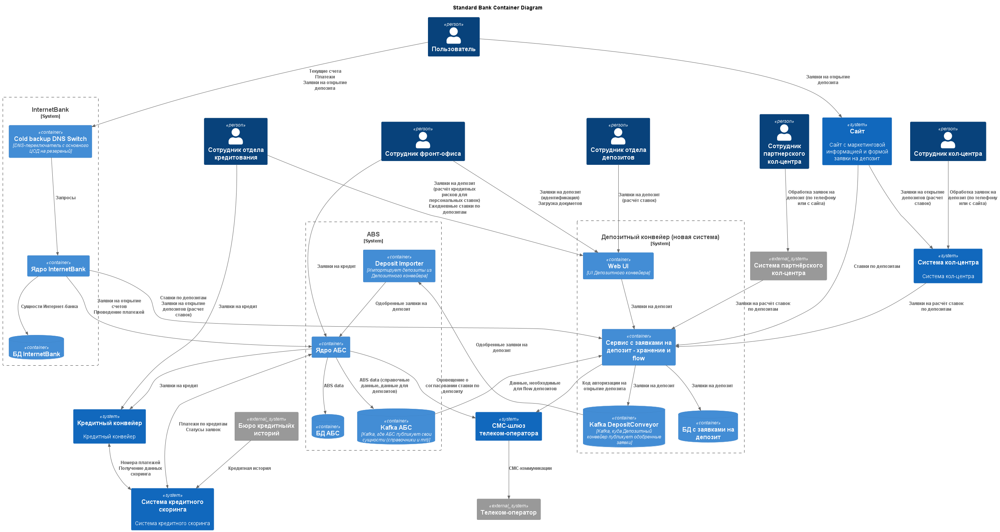

### **Название задачи:** 
### **Автор:**
### **Дата:**
### **Функциональные требования**

|**№**|**Действующие лица или системы**|**Use Case**|**Описание**|
| :-: | :- | :- | :- |
| UC1 | Пользователь, Сайт, АБС|Просмотр ставок по депозитам|1. Пользователь заходит на сайт 2. Сайт получает данные по ставкам из Депозитного конвейера по API 3. Сайт отображает ставки|
| UC2 | Пользователь, Сайт, Система кол-центра|Создание заявки на депозит | 1. Пользователь заходит на сайт и отправляет заявку на депозит с телефоном и ФИО 2. Сайт создаёт заявку в системе кол-центра или в системе партнёрского кол-центра |
| UC3 | Пользователь, Интернет-банк, Депозитный конвейер | Просмотр ставок по депозитам | 1. Пользователь заходит в Интернет-банк 2. Интернет-банк получает данные по ставкам из Депозитного конвейера 3. Интернет-банк отображает ставки, включая персонализированные, если они были рассчитаны ранее |
| UC5 | Пользователь, Интернет-банк, Депозитный конвейер | Создание заявки на депозит | 1. Пользователь указывает счёт и сумму депозита, подаёт заявку 2. Интернет-банк инициирует создание заявки в Депозитном конвейере 3. Депозитный конвейер отправляет СМС с кодом подтверждения 4. Пользователь вводит код подтверждения в Интернет-банке 5. Интернет-банк подтверждает создание заявки в Депозитном конвейере |
| UC6 | Сотрудник кол-центра, Система кол-центра, Депозитный конвейер | Первичная обработка заявки на депозит с сайта - расчёт ставки | 1. Сотрудник кол-центра видит заявки в списке заявок 2. Сотрудник кол-центра открывает заявку и изучает её 3. Сотрудник кол-центра передает заявку в бэк-офис (по кнопке) 4. Система кол-центра отправляет заявку на расчёт окончательной ставки в Депозитный конвейер 3b. Сотрудник кол-центра отклоняет заявку (например потому, что там указано заведомо неверное ФИО / телефон) 3с. Сотрудник кол-центра видит, что пользователь не новый и связывается с ним с просьбой подать заявку через Интернет-банк |
| UC7 | Сотрудник отдела депозитов, Депозитный конвейер | Согласование ставки по заявке на депозит | 1. Сотрудник отдела депозитов видит заявку на депозит 2. Сотрудник отдела депозитов вычисляет ставку и вносит её в Депозитный конвейер 3. Сотрудник отдела депозитов одобряет заявку 4. Депозитный конвейер делает данные по ставке доступными сотрудникам фронт-офиса и КС 2b. Если у сотрудника достаточно средств на счетах, сотрудник отдела депозитов формирует запрос в Депозитном конвейере в отдел кредитования на расчёт кредитного риска 3b. В Депозитном конвейере заявка на расчёт кредитного риска становится видимой сотруднику отдела кредитования | 
| UC8 | Сотрудник отдела кредитования, Депозитный конвейер | Расчёт кредитного риска для согласования специальных ставок | 1. Сотрудник отдела кредитования видит заявку на расчёт кредитного риска 2. Сотрудник отдела кредитования анализирует текущий уровень кредитного риска для банка в своём разделе АБС относительно этого клиента Сотрудник отдела кредитования заполняет данные в заявке и закрывает её 4. Депозитный конвейер делает данные по кредитному риску доступными сотрудникам отдела депозитов  | 
| UC9 | Сотрудник фронт-офиса, Депозитный конвейер | Расчёт ставок по депозиту | 1. Сотрудник фронт-офиса создаёт заявку на расчёт ставок по депозиту в Депозитном конвейере 2. В Депозитном конвейере заявка становится видимой сотруднику отдела депозитов |
| UC10 | Сотрудник фронт-офиса, Депозитный конвейер | Создание депозита с известной ставкой | 1. Сотрудник фронт-офиса подтверждает открытие депозита по рассчитанной ставке |
| UC11 | Сотрудник отдела кредитования, Депозитный конвейер | Ежедневный расчёт ставок по депозитам | 1. Сотрудник отдела кредитования рассчитывает общие ставки и вносит их в Депозитный конвейер 2. Депозитный конвейер делает их видимыми заинтересованным ролям и экспортирует во внешние системы |
### **Нефункциональные требования**

|**№**|**Требование**|
| :-: | :- |
| 1 | Все сервисы АБС и Интернет-банка должны работать 24/7 |
| 2 | Все сервисы АБС и Интернет-банка должны быть доступны в 99,9% случаев |
| 3 | Отклик по всем операциям на сайте и в Интернет-банке должен быть максимально быстрым и занимать миллисекунды |
| 4 | Данные, которые пользователь заполняет на сайте - ПД, нужно обеспечить работу с ними соответствующим образом (шифровать при передаче, хранить в соответствии с ФЗ и тп) |
| 5 | Процесс публикации и согласования ставок по депозитам реализован с учётом того, что разные роли имеют доступ к разным данным |
| 6 | Система выдерживает отключение одного из 2х ЦОД |
| 7 | Система масштабируется (желательно горизонтально) |
| 8 | Система выдерживает проектную нагрузку (определить) |
| 9 | Нужно придерживаться системы дизайна для приложений, которая принята в компании, пользователи при работе должны видеть привычные цвета и брендированные элементы |

### **Решение**

Решение разработано из следующих предпосылок:

1. Заявка на депозит для одобрения и открытия депозита должна обладать двумя атрибутами:
    * Подтверждённые идентификационные данные пользователя
    * Подтверждённая ставка по депозиту
Эти атрибуты могут быть получены в любом порядке и разными способами.
2. Нет жестких требований по скорости открытия депозита

Вводится новая система - Депозитный конвейер, она по сути заменяет почту, там живут заявки на депозит.

Данные, необходимые для расчёта ставок в ней появляются из АБС, АБС публикует их в Kafka.

Одобренные заявки из Депозитного конвейера периодическими job-ами экспортируются в АБС, чтобы избежать чрезмерной нагрузки - batch обработка дешевле, её можно проводить по ночам, нагрузка на API не создаётся.

Для реализации доступности 99,9% для Интернет-банка вводится DNS-переключатель между ДЦ, нужен будет внешний мониторинг.

### **Альтернативы**

Модифицировать АБС и внести в неё flow депозитов или его часть (см. ниже).

Реализовать flow депозитов в Кредитном конвейере.

**Недостатки, ограничения, риски**

1. Схема с batch-экспортом уже одобренных депозитов из Депозитного конвейера в АБС сломается, если пользователь потратит деньги со счёта, который он предполагал использовать для открытия депозита. Это плата за то, что мы почти не трогаем АБС. Можно внести в договор что-то типа "пользователь гарантирует наличие средств на текущем счёте X в течение 24 часов иначе депозит аннулируется". Для MVP должно быть приемлемым.

2. Может оказаться сложным модифицировать АБС так, чтобы она публиковала все необходимые данные для Депозитного конвейера по двум причинам:
    * Oracle PL/SQL и Kafka плохо дружат - на первый взгляд задача решаемая
    * Слишком много сущностей надо будет модифицировать и непонятно какие

3. Работникам банка может быть неудобно работать ещё в одной системе, хотя всё равно должно быть лучше, чем в почте.

4. Нужны дополнительные ресурсы для Депозитного конвейера - как инфраструктурные так и ресурсы разработки

### **Схемы**

#### Диаграмма контекста

#### Диаграмма контейнеров

