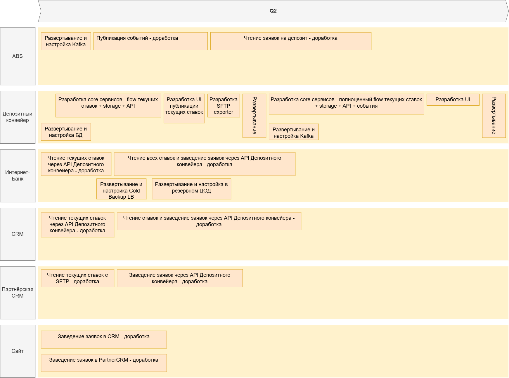
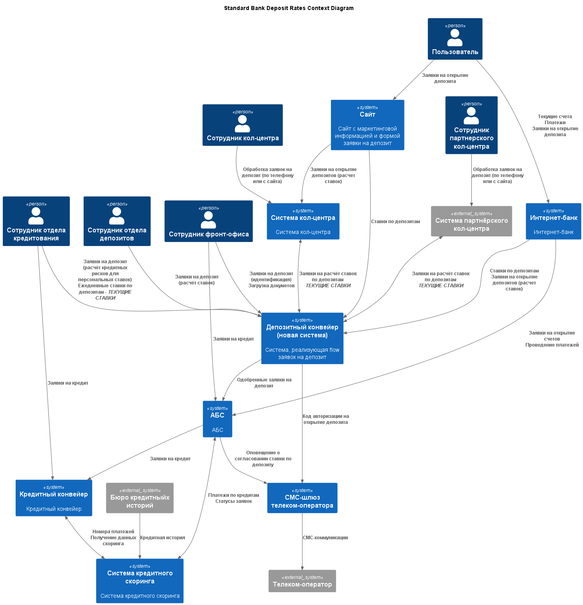
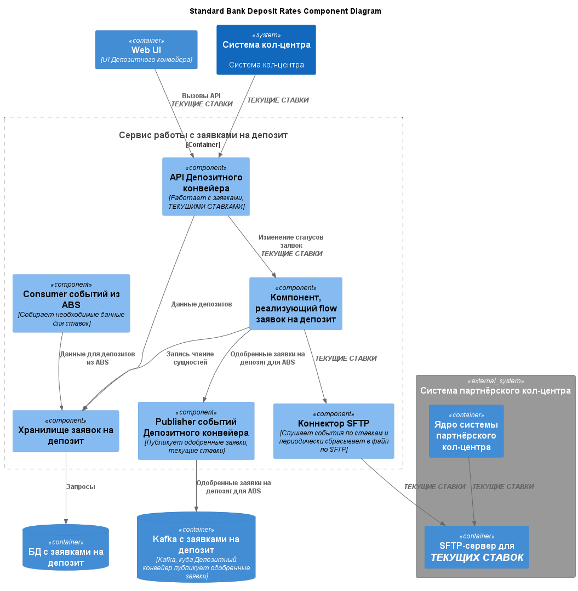

### **Название задачи:** Передача ставок в кол-центр
### **Автор:** Антон О
### **Дата:** 28 июля 2026 г.
### **Функциональные требования**

|**№**|**Действующие лица или системы**|**Use Case**|**Описание**|
| :-: | :- | :- | :- |
| UC1 | Сотрудник отдела депозитов, Депозитный конвейер | Ежедневный расчёт ставок по депозитам | 1. Сотрудник отдела депозитов рассчитывает общие ставки и вносит их в Депозитный конвейер 2. Депозитный конвейер делает их видимыми заинтересованным ролям и экспортирует во внешние системы |
| UC2 | Сотрудник кол-центра, Система кол-центра | Просмотр текущих ставок по депозитам | 1. Сотрудник кол-центра видит ставки по депозитам в специальном разделе |
### **Нефункциональные требования**

|**№**|**Требование**|
| :-: | :- |
|1|Экспорт ставок должен происходить как во внутреннюю систему кол-центра так и во внешнюю систему партнёрского кол-центра|
|2|Внешняя система партнёрского кол-центра не может принимать ставки в реальном времени, экспорт ставок будет осуществляться по SFTP, Депозитный конвейер будет выкладывать ставки на SFTP-сервер|
### **Решение**

Данные требования хорошо вписываются в аритектуру из задачи 3, Системы кол-центра и Партнёрского кол-центра будут интегрированы с Депозитным конвейером.

Заведение текущих ставок уже было предусмотрено на предыдущем этапе.

#### Задачи

[WBS](WBS.md)

#### Roadmap

#### Диаграмма контекста

#### Диаграмма компонентов

### **Альтернативы**

Попробовать "развести" потоки и не привлекать партнёрский кол-центр для flow депозитов - тогда не нужна будет схема с SFTP.

**Недостатки, ограничения, риски**

Схема с SFTP может пострадать из-за задержек - откроют депозит по неверной ставке и тп.

