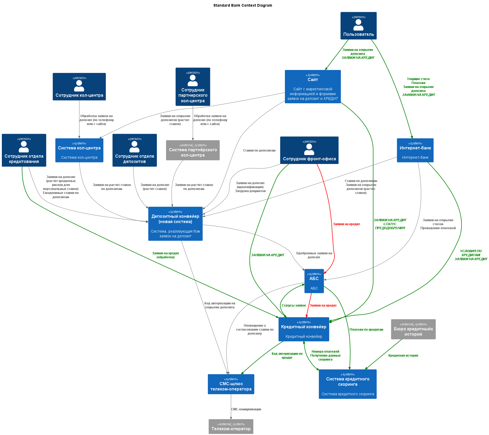
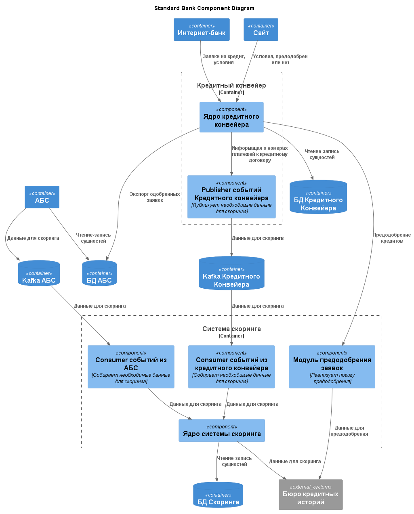

### **Название задачи:** Заявка на кредит онлайн
### **Автор:** Антон О
### **Дата:** 28 июля 2026 г.
### **Функциональные требования**

|**№**|**Действующие лица или системы**|**Use Case**|**Описание**|
| :-: | :- | :- | :- |
| UC1 | Пользователь, Сайт, Кредитный конвейер|Просмотр условий по кредиту|1. Пользователь заходит на сайт 2. Сайт получает условия из Кредитного конвейера по API 3. Сайт отображает условия|
| UC2 | Пользователь, Сайт, Кредитный конвейер, Система скоринга|Создание заявки на кредит|1. Пользователь заходит на сайт и отправляет заявку на кредит с телефоном и ФИО 2. Сайт создаёт заявку в Кредитном конвейере 2b. Пользователь заполняет паспортные данные 3b. Сайт делает запрос в Кредитный конвейер 4b. Кредитный конвейер делает запрос в Систему скоринга 5b. Система скоринга делает запрос в Бюро кредитных историй и возвращает предодобрен ли кредит или нет 6. Кредитный конвейер отправляет СМС, пользуясь шлюзом |
| UC3 | Пользователь, Интернет-банк, Кредитный конвейер|Просмотр условий по кредиту|1. Пользователь заходит на сайт 2. Сайт получает условия из Кредитного конвейера по API включая предодобренные кредиты 3. Интернет-банк отображает условия|
| UC4 | Пользователь, Интернет-банк, Кредитный конвейер | Создание заявки на кредит | 1. Пользователь указывает счёт зачисления средств и другие данные, подаёт заявку 2. Интернет-банк инициирует создание заявки в Кредитном конвейере 3. Кредитный конвейер отправляет СМС с кодом подтверждения 4. Пользователь вводит код подтверждения в Интернет-банке 5. Интернет-банк подтверждает создание заявки в Кредитном конвейере |
| UC5 | Сотрудник отдела кредитования, Кредитный конвейер, Система скоринга, Бюро кредитных историй | Согласование условий по кредиту | 1. Сотрудник отдела кредитования видит заявку на кредит 2. Сотрудник отдела кредитования изучает детали заявки 4. Кредитный конвейер получает дянные из API Системы скоринга 5. Система скоринга получает данные из API бюро кредитных историй 6. Сотрудник отдела кредитования одобряет заявку 7. Кредитный конвейер отправляет заявку в АБС через БД 8. АБС отсылает СМС о статусе заявки | 
| UC6 | Сотрудник фронт-офиса, Кредитный конвейер | Создание заявки на кредит | 1. Сотрудник фронт-офиса создаёт заявку на кредит в Кредитном конвейере 2. В Кредитном конвейере заявка становится видимой сотруднику отдела кредитования |

### **Нефункциональные требования**

|**№**|**Требование**|
| :-: | :- |
| 1 | Все сервисы АБС и Интернет-банка должны работать 24/7 |
| 2 | Все сервисы АБС и Интернет-банка должны быть доступны в 99,9% случаев |
| 3 | Отклик по всем операциям на сайте и в Интернет-банке должен быть максимально быстрым и занимать миллисекунды |
| 4 | Данные, которые пользователь заполняет на сайте - ПД, нужно обеспечить работу с ними соответствующим образом (шифровать при передаче, хранить в соответствии с ФЗ и тп) |
| 5 | Система выдерживает отключение одного из 2х ЦОД |
| 6 | Система масштабируется (желательно горизонтально) |
| 7 | Система выдерживает проектную нагрузку (определить?) |
| 8 | Нужно придерживаться системы дизайна для приложений, которая принята в компании, пользователи при работе должны видеть привычные цвета и брендированные элементы |
| 9 | Система кредитного скоринга очень важна для работы банка и испытывает повышенную нагрузку в рабочие часы, её не нужно нагружать дополнительными процессами по предрасчетам скорингов |

### **Решение**

Менеджеры фронт-офиса работают в Кредитном конвейере вместо АБС, тк Кредитный конвейер масштабируется и не будет дополнительной нагрузки на АБС.

Также исчезает bottleneck "сейчас заявки попадают в Кредитный конвейер раз в сутки из АБС".

Также закрываем требование "Сотрудник должен продолжить работать с той же заявкой на кредит" для предодобренных заявок.

АБС публикует необходимые для одобрения кредита данные (данные о клиентах, оплаты кредитов от клиента, платежи по кредиту), Система скоринга ими пользуется. Точно так же делает Кредитный конвейер. Это сделано для того, чтобы к моменту попадания в заявке в Кредитный конвейер для её обработки были бы все необходимые данные. 

#### На диаграммах ниже см. элементы, отмеченные зелёным цветом - они относятся к кредитному flow, красным цветом - старый flow, должен быть "разобран"

#### Диаграмма контекста

#### Диаграмма компонентов

### **Альтернативы**

Вместо заведения всех заявок в Кредитном конвейере ускорять обмен между АБС и Кредитным конвейером с помощью той же Kafka.

**Недостатки, ограничения, риски**

1. Может оказаться сложным модифицировать АБС так, чтобы она публиковала все необходимые данные для Кредитного конвейера по двум причинам (та же проблема, что и в задании 3):

    * Oracle PL/SQL и Kafka плохо дружат - на первый взгляд задача решаемая
    * Слишком много сущностей надо будет модифицировать и непонятно какие

2. С одной стороны сказано, что систему скоринга нельзя нагружать в рабочие часы предрасчётами, с другой - что она хорошо масштабируется и что предрасчёт затрагивает только внешнее API Бюро кредитных историй. Поэтому в текущей архитектуре запросы по предрасчёту идут в систему скоринга, но (почти) не трогают её основной функционал. Риск - упереться в пропускную способность БКИ, придётся задерживать предрасчёты например до ночи тк сами предрасчёты некритичны.

3. Нагрузка на скоринг за счёт большего количества заявок на кредит вырастет в любом случае, систему надо будет масштабировать.

4. Несмотря на то, что в системе скоринга есть отдельный flow предодобрения, он по-прежнему интегрирован в монолит системы скоринга - это может сделать масштабирование менее эффективным.

5. Сайт напрямую не ходит в скоринг для предодобрения, делает через Кредитный конвейер, можно наверное сделать, чтобы ходил.